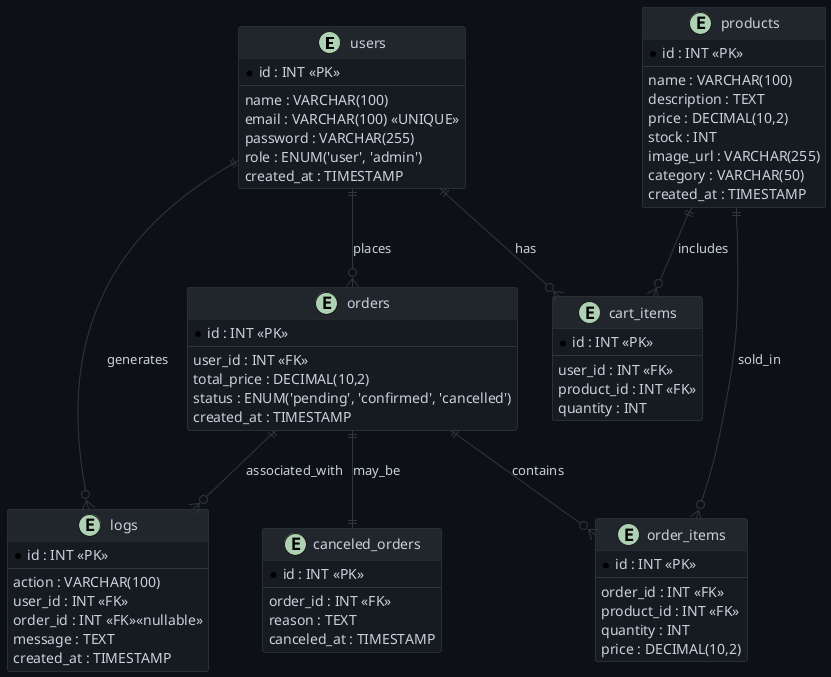

<p align="center">
  
</p>

## Project Summary

**CourtKart** is a pure PHP and MySQL-based e-commerce web application tailored for basketball enthusiasts. It offers a clean shopping experience for buying basketball shoes, jerseys, balls, accessories, and more—complete with admin controls, search filters, cart system, and backend database logic including procedures and triggers.

---

## Features

### User Features

- View all basketball-related products
- See item details with image, price, and description
- Search and filter products
- Register, login, and logout
- Add/remove/view items in cart
- Finalize orders

### Admin Features

- Access a dedicated admin panel
- Add new products to the shop

### Database Logic

- Use of stored procedures:
  - Show order details and total price
  - Finalize order & empty cart
  - View order history
- Use of triggers:
  - Decrease stock after order
  - Prevent order if stock is insufficient
  - Restore stock when order is canceled
  - Log canceled orders into a history table

---

## Screenshots

_Screenshots will be added soon..._

---

## Technologies Used

- **Frontend**: HTML, CSS, JavaScript (vanilla)
- **Backend**: PHP (no frameworks)
- **Database**: MySQL
- **Hosting**: Localhost via XAMPP, MAMP, or LAMP
- **Sessions & Cookies**: For cart and user auth

---

## Folder Structure

```plaintext
court-kart-store/
├── index.php                  ← homepage
├── shop/
│   ├── index.php              ← list products
│   ├── item.php               ← product details
│   ├── search.php             ← filter logic
├── cart/
│   ├── view.php               ← show cart
│   ├── add.php                ← add to cart
│   └── remove.php             ← remove from cart
├── auth/
│   ├── login.php
│   ├── logout.php
│   └── register.php
├── admin/
│   ├── index.php              ← admin dashboard
│   └── add_item.php           ← add new product
├── assets/
│   ├── styles.css             ← all styles
│   └── scripts.js             ← all JS
├── includes/
│   ├── db.php                 ← database connection
│   ├── header.php             ← navbar, head
│   └── footer.php             ← footer content
├── sql/
│   ├── schema.sql             ← table creation
│   ├── procedures.sql         ← procedures
│   └── triggers.sql           ← triggers
```

---

## Database Schema (ERD)



## Author

Made by [Adel2411](https://github.com/Adel2411)  
For educational purposes — built with ❤️ for basketball and clean code.

---

## License

This project is open source and available under the [MIT License](LICENSE).

---

> **Disclaimer**: This project is built without any external libraries or frameworks, intended for local development and academic demonstration only.
