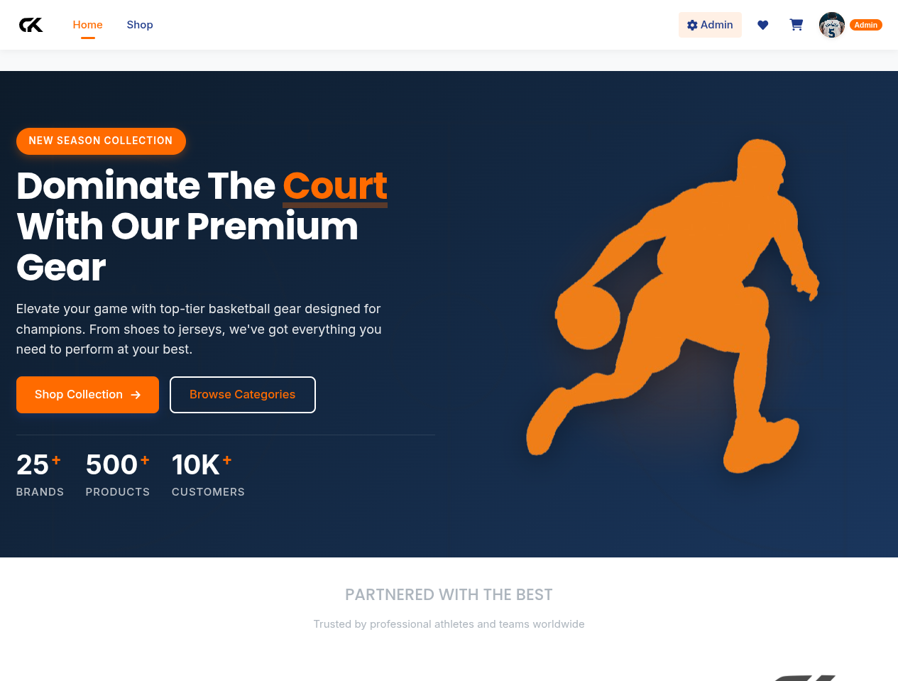
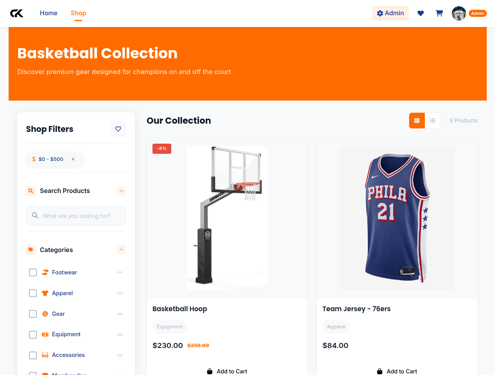
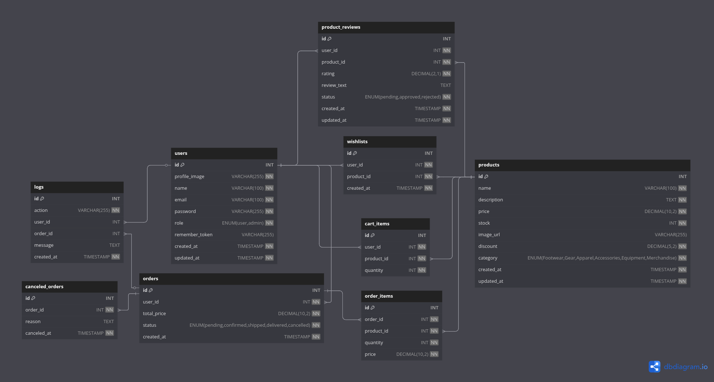

<p align="center">
  
</p>

# Court-Kart Store

## Project Summary

**CourtKart** is a full-featured e-commerce web application built with pure PHP and MySQL, specifically designed for basketball enthusiasts. The platform offers a seamless shopping experience for basketball shoes, jerseys, equipment, and accessories—implementing a complete solution with robust user management, product catalog, shopping cart functionality, wishlist features, and comprehensive admin controls.

This project demonstrates advanced PHP concepts including MVC architecture, session management, secure authentication, and complex database operations with stored procedures and triggers.

---

## Features

### Customer Features

- **Product Browsing**: Browse through categorized basketball products with grid and list views
- **Advanced Filtering**: Find products by name, price range, category, and sort by various criteria
- **User Account Management**: Register, login, view profile, and track order history
- **Product Details**: View comprehensive product information, images, and specifications
- **Shopping Cart**: Add/remove items, adjust quantities, view cart totals
- **Wishlist Management**: Save favorite products for future reference
- **Product Reviews**: Read and submit reviews and ratings for products
- **Checkout Process**: Address entry, payment method selection, order confirmation
- **Order Tracking**: View status and details of past orders

### Admin Features

- **Dashboard**: Overview of store performance and key metrics
- **Product Management**: Add, edit, and remove products from inventory
- **Order Administration**: Process orders, update status, and view order details
- **User Management**: View and manage customer accounts
- **Inventory Control**: Monitor stock levels with automatic alerts

### Technical Features

- **Responsive Design**: Mobile-first approach for all device compatibility
- **Form Validation**: Client and server-side validation for data integrity
- **Session Management**: Secure PHP session handling
- **Database Operations**: Stored procedures and triggers for complex operations
- **Security**: Protection against XSS, CSRF, and SQL injection
- **AJAX Integration**: Dynamic content loading for improved user experience

---

## Technology Stack

- **Frontend**: 
  - HTML5, CSS3 with responsive design
  - Vanilla JavaScript with modular organization
  - Font Awesome icons
  
- **Backend**: 
  - PHP 8.0+ (no frameworks)
  - MVC architecture
  - Custom routing system
  
- **Database**: 
  - MySQL 8.0+
  - Stored procedures
  - Database triggers
  
- **Development Environment**: 
  - XAMPP/LAMP stack

---

## Project Structure

```plaintext
court-kart-store/
├── public/                    # Public accessible files
│   ├── index.php             # Application entry point
│   ├── assets/               # Static assets
│   │   ├── css/              # Stylesheets (main, components, layouts, pages)
│   │   ├── js/               # JavaScript files (main, pages)
│   │   └── images/           # Images and product photos
│   └── .htaccess             # URL rewriting rules
├── src/                       # Application source code
│   ├── Core/                 # Framework core components
│   │   ├── Database.php      # Database connection handler
│   │   ├── Router.php        # URL routing system
│   │   ├── Middleware.php    # Request middleware
│   │   ├── Session.php       # Session management
│   │   └── View.php          # Template rendering
│   ├── Controllers/          # Request handlers
│   │   ├── HomeController.php
│   │   ├── ShopController.php
│   │   ├── CartController.php
│   │   ├── WishlistController.php
│   │   ├── AuthController.php
│   │   ├── OrderController.php
│   │   ├── CheckoutController.php
│   │   ├── AccountController.php
│   │   ├── AdminController.php
│   │   └── ApiController.php
│   ├── Models/               # Data models
│   │   ├── User.php
│   │   ├── Product.php
│   │   ├── Cart.php
│   │   ├── Wishlist.php
│   │   ├── Order.php
│   │   ├── Review.php
│   │   └── Category.php
│   ├── Services/             # Business logic services
│   │   └── AuthService.php
│   └── Helpers/              # Utility functions
│       ├── Security.php
│       └── Validator.php
├── views/                     # Template files
│   ├── layouts/              # Reusable layouts
│   │   ├── main.php          # Main site layout
│   │   ├── admin.php         # Admin panel layout
│   │   └── footer.php        # Footer partial
│   ├── partials/             # Partial templates
│   │   └── account-sidebar.php
│   ├── shop/                 # Shop pages
│   │   ├── index.php         # Product listing page
│   │   └── product.php       # Product detail page
│   ├── wishlist/             # Wishlist views
│   │   └── index.php
│   ├── cart/                 # Shopping cart views
│   │   └── index.php
│   ├── checkout/             # Checkout process views
│   │   └── index.php
│   ├── orders/               # Order management
│   │   ├── index.php
│   │   └── show.php
│   ├── account/              # User account views
│   │   ├── index.php
│   │   └── edit.php
│   ├── admin/                # Admin panel views
│   │   ├── products.php
│   │   ├── orders.php
│   │   └── order-detail.php
│   ├── home.php              # Homepage template
│   └── errors/               # Error pages
│       ├── 404.php
│       └── unauthorized.php
├── routes/                    # Routing configuration
│   ├── web.php               # Web routes definition
│   └── api.php               # API routes definition
├── config/                    # Configuration files
│   ├── app.php
│   └── database.php
├── docs/                      # Documentation
│   └── report.tex            # Technical documentation
└── bootstrap.php              # Application initialization
```

---

## Key Components

### 1. Routing System
The application uses a custom routing system located in `routes/web.php` that maps URLs to controller actions and supports middleware for authentication:

```php
// Public routes
$router->get('/', 'HomeController@index');
$router->get('/shop', 'ShopController@index');
$router->get('/shop/product/{id}', 'ShopController@show');

// Auth protected routes
$router->get('/wishlist', 'WishlistController@index', 'auth');
$router->post('/wishlist/add', 'WishlistController@add');
$router->get('/cart', 'CartController@index', 'auth');
$router->post('/cart/add', 'CartController@add', 'auth');

// Admin routes
$router->get('/admin/products', 'AdminController@products', 'admin');
```

### 2. View Rendering
Templates are managed through the `View` class which supports layouts and partial templates:

```php
// Render a view with layout
echo View::renderWithLayout('shop/product', 'main', [
    'title' => $product['name'].' - Court Kart',
    'product' => $product,
    'reviews' => $reviews,
    'average_rating' => $averageRating,
    'page_css' => 'product'
]);
```

### 3. Database Interaction
Models interact with the database and encapsulate data operations:

```php
// Get filtered products with pagination
$products = Product::getProductsWithFilters([
    'category' => $_GET['category'] ?? null,
    'search' => $_GET['search'] ?? null,
    'min_price' => $_GET['min_price'] ?? null,
    'max_price' => $_GET['max_price'] ?? null,
    'product_ids' => $wishlistOnly ? $wishlistItems : null
], $_GET['sort'] ?? 'newest', $page, $perPage);
```

### 4. Middleware System
The application uses middleware to protect routes and enforce authentication:

```php
public static function auth(): bool
{
    $authService = new AuthService;

    if (!$authService->isLoggedIn()) {
        Session::set('redirect_after_login', $_SERVER['REQUEST_URI']);
        header('Location: /login');
        exit;
    }

    return true;
}
```

### 5. Wishlist Management
The application includes a complete wishlist system for users to save products:

```php
// Check if product is in user's wishlist
$wishlistModel = new Wishlist();
$isInWishlist = $wishlistModel->isInWishlist($_SESSION['user_id'], $productId);

// Toggle wishlist status
if ($alreadyInWishlist) {
    $success = $wishlistModel->remove($userId, $productId);
} else {
    $success = $wishlistModel->add($userId, $productId);
}
```

---

## Installation & Setup

1. **Clone the repository**

   ```
   git clone https://github.com/Adel2411/court-kart-store.git
   cd court-kart-store
   ```

2. **Configure your web server**

   - Set document root to the `public` directory
   - Ensure PHP 8.0+ is installed and configured
   - Enable required PHP extensions (PDO, mysqli, etc.)

3. **Create and populate the database**

   ```
   mysql -u username -p < database/schema.sql
   mysql -u username -p < database/seed.sql
   ```

4. **Configure database connection**

   - Edit `config/database.php` with your credentials

5. **Set file permissions** (for Linux/Unix)

   ```
   chmod -R 755 public/
   chmod -R 777 public/assets/uploads/
   ```

6. **Start your local server**

   - Launch XAMPP/MAMP/LAMP
   - Or use PHP's built-in server: `php -S localhost:8000 -t public`

7. **Access the application**
   - Navigate to `http://localhost:8000` in your browser
   - Admin access: Use credentials admin@courtkart.com / admin123

---

## Screenshots

<p align="center">
  
  
</p>

---

## Database Schema

The database uses a normalized schema with tables for users, products, categories, orders, order_items, cart_items, wishlists, and product_reviews. Key relationships include one-to-many between users and orders, and many-to-many between orders and products via order_items.

<p align="center">
  
</p>

---

## Author

Made with ❤️ by [Adel2411](https://github.com/Adel2411)  
For educational purposes — crafted for basketball enthusiasts and clean code advocates.

---

## License

This project is open source and available under the [MIT License](LICENSE).

---

> **Note**: This project is built without external frameworks or libraries, focusing on core PHP principles and clean code structure.
